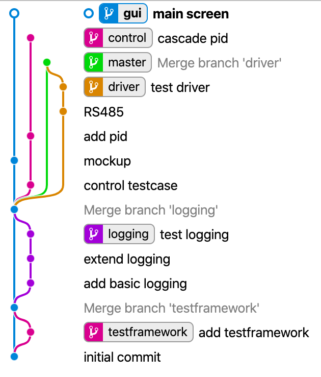

---
presentation:
  width: 1200
  height: 800
  # theme: simple.css
---

<!-- slide -->
# The value of...

## a state-of-the-art
## software development process

and its underestimated features

<!-- slide vertical -->
## Why I Appreciate
## the value of...

- sw tests
- feature branches
- sw reviews

<!-- slide -->
## The value of software tests

- incubator for feature development
  <!-- .element: class="fragment" -->
  - maybe implement test driven?
- encurage thinking before coding
  <!-- .element: class="fragment" -->
  - focus coding on single feature
  - plan interfaces
  - increase modularity
- sample code for main use cases
  <!-- .element: class="fragment" -->
  - up to date developer documentation
- progress indicator
  <!-- .element: class="fragment" -->
  - definition of done
  - fun!

<!-- slide vertical=true -->
## The value of software tests (2)

- debugging tool
  <!-- .element: class="fragment" -->
  - reproduce error condition
  - divide and conquer
- make up regression test suite
  <!-- .element: class="fragment" -->
  - detect bugs early => cheap to fix
  - tests will guide you to the bug
- basis for refactoring
  <!-- .element: class="fragment" -->
  - refactor to keep sw fit
  - tests detect hidden side effects
- contribute to V&V effort
  <!-- .element: class="fragment" -->
- tests do speedup develoment!
  <!-- .element: class="fragment" -->

<!-- slide -->
## The value of feature branches

- feature branch comprises complete development step
  <!-- .element: class="fragment" -->
  - implementation
  - documentation adjustment
  - build system adjustment
  - sample usage as testcase
- separate stubs/experiments from master
  <!-- .element: class="fragment" -->
  - hand over stubs to other developer
  - maybe keep experiments for later use
  - playground for newbies to contribute
- context for related changes
  <!-- .element: class="fragment" -->
  - do code review, cleanup, fix tests *before* merging
  - recap context of code change from history
- keep master clean and consistent
  <!-- .element: class="fragment" -->
  - no partial features on master
  - master is always fit and ready for release

<!-- slide -->
## The value of software reviews

- review and adjust feature before merge
  <!-- .element: class="fragment" -->
  - birds eye view on feature
  - related changes in context
  - cleanup obsolete (explorative) code
  - ensure compliance with coding guidelines
  - test(s) maintained?
- mentoring
  <!-- .element: class="fragment" -->
  - get second opinion
  - share knowledge
  - teach
  - evaluate sw design & side effects
- encourage/enable new team members to contribute
  <!-- .element: class="fragment" -->
  - ! 50% newbies (<5a experience) at any time !

<!-- slide -->
## Appreciate
## the value of...

- sw tests
- feature branches
- sw reviews
